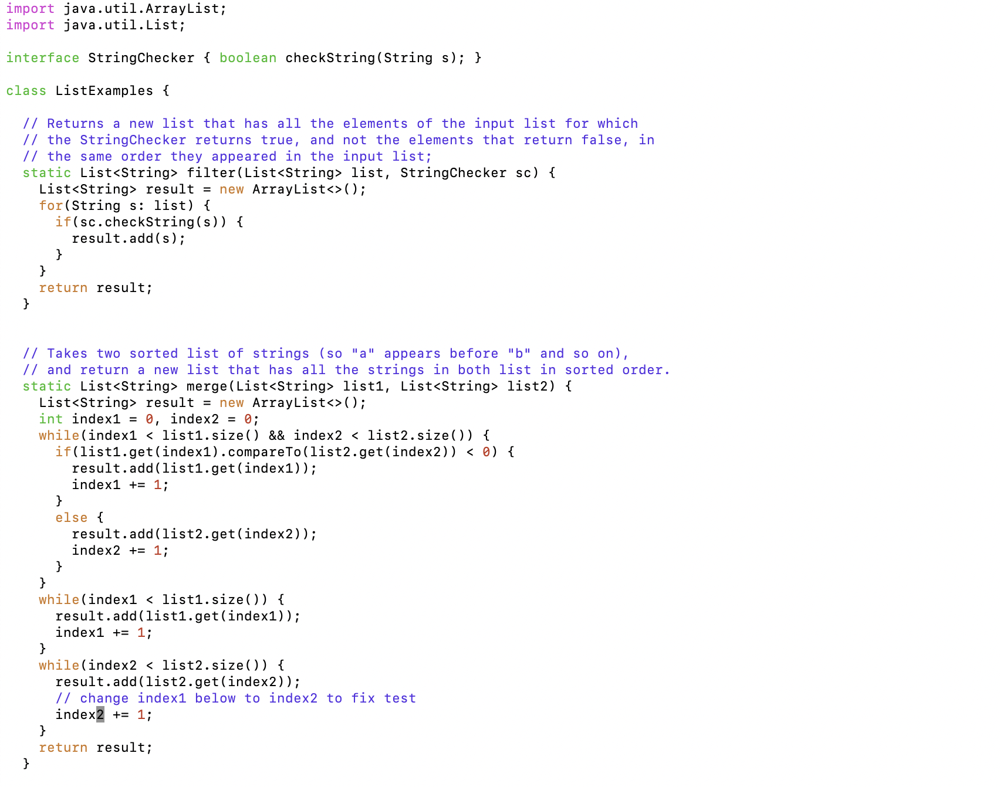

# Lab Report 4

## Log into ieng6


Keys pressed:
```
ssh<space>cs15lfa23jq@ieng6.ucsd.edu<enter>
```
Summary:
Remotely connected to ieng6 account

## Clone your fork of the repository from your Github account (using the SSH URL)


Keys Pressed:
```
git<space>clone<space>git@github.com:CalKong/lab7.git<enter>
```
Summary:
Cloned the fork of my repository using SSH url

## Run the tests, demonstrating that they fail


Keys Pressed:
```
cd<space>l<tab><enter>
bash<space>t<tab><enter>
```
Summary: Changed working directory to lab7 and used tab to autocomplete. Then ran the tests using the script test.sh and used autocomplete as well. 

## Edit the code file to fix the failing test



Keys Pressed:
```
vim<space>L<tab>.<tab><enter>
bash<space>t<tab><enter>
?index1<enter>lllllr2<esc>:wq<enter>
```

## Run the tests, demonstrating that they now succeed


Keys Pressed:
```
bash<space>t<tab><enter>
```
Summary: Ran the tests using the script test.sh and used autocomplete as well. 

## Commit and push the resulting change to your Github account (you can pick any commit message!)


Keys Pressed:
```
git<space>add<space>L<tab><enter>
git<space>commit<space>-m<space>Fixed<enter>
git<space>push<enter>
```
Summary:
Added the edited file to prepare for commit and used autocomplete. Then committed the changes using the -m option to include the commit message as the next arguemnt, and then pushed the changes to github account. 
